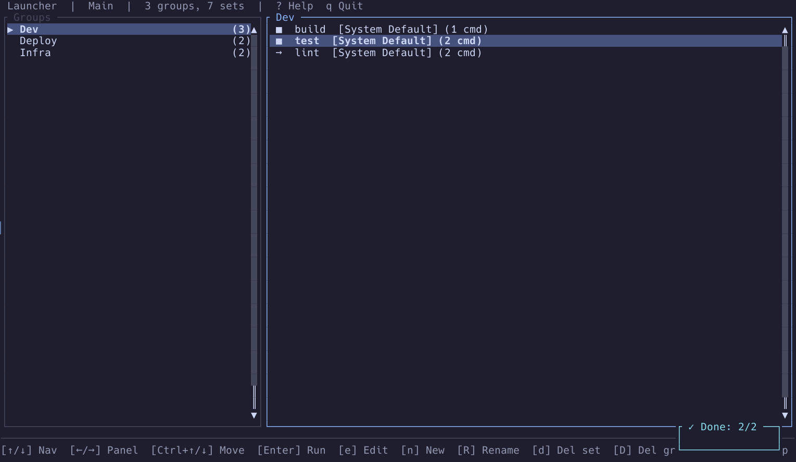
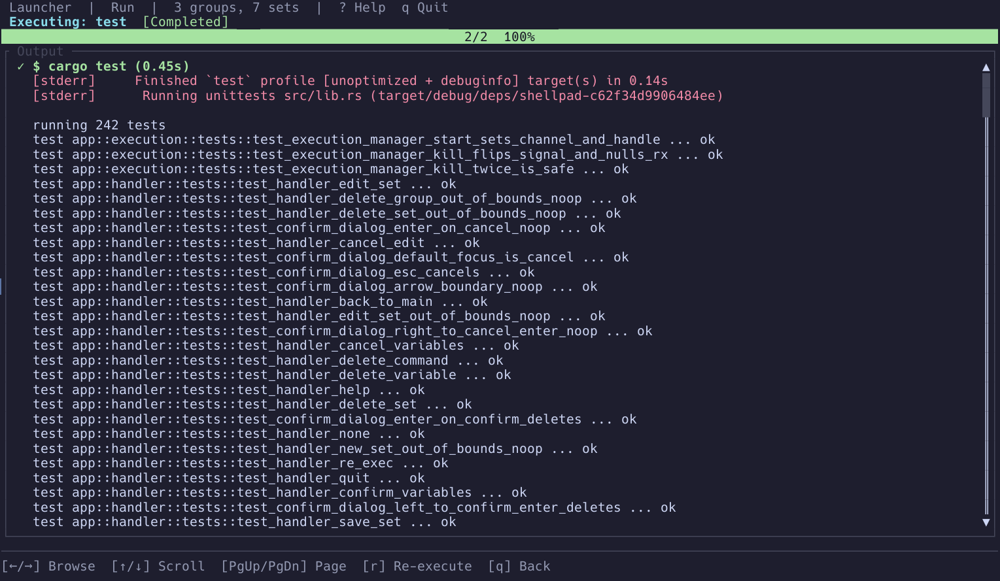

# ShellPad

[](https://github.com/LHYWilliam/shellpad/actions/workflows/test.yml)
[](https://crates.io/crates/shellpad)


A Ratatui-based TUI for organising and executing collections of shell commands.
Inspired by task runners like `just` and `make`, but interactive.





## Features

- **Command Sets** — Group shell commands into named groups and sets, edit inline
- **Defer Commands** — Cleanup/teardown commands that run after normal commands, even on interrupt
- **Fuzzy Search** — Character-level fuzzy matching across command sets and command text
- **Import/Export** — CLI `export --all`/`--id` and `import --input` with pipe-friendly stdin/stdout
- **Dual Execution Modes** — Stop on error or continue on error per command set
- **Variables** — Template substitution with `{{var}}` syntax, configure per-execution
- **Multi-Shell** — bash, zsh, fish, PowerShell, System Default, or custom shell path per command set
- **Real-time Output** — Stream stdout/stderr with per-command status timing, auto-scroll
- **Output Buffer** — 10,000-line ring buffer prevents runaway memory growth, drops oldest lines gracefully
- **Execution Search** — `/` to search output lines across all commands, real-time substring highlighting, ↑/↓ to jump between matches
- **Working Directory** — Set a per-command-set working directory, defaults to shellpad CWD
- **Tab Navigation** — Tab/Shift+Tab cycles Properties ↔ Variables ↔ Commands ↔ Deferred Commands, ↑/↓ navigates within each region
- **Reordering** — Ctrl+Up/Down reorder groups, sets, variables, and commands
- **Delete Confirmation** — Modal confirmation dialog with Confirm/Cancel buttons
- **Undo Delete** — Ctrl+Z restores recently deleted groups and sets, multi-level LIFO stack with status bar hint
- **Atomic Persistence** — Crash-safe JSON save at `~/.config/shellpad/sets.json`
- **CLI Mode** — Execute, search, import/export command sets from the terminal
- **289 Tests** — Comprehensive unit, handler, and integration test coverage
- **Published on crates.io** — Install with `cargo install shellpad`

## Installation

```bash
# From crates.io (recommended)
cargo install shellpad

# From source
git clone https://github.com/LHYWilliam/shellpad
cd shellpad
cargo install --path .
```

The binary is `shellpad`. It requires a terminal ≥ 80×24.

## Quick Start

New to shellpad? Clone the repo and load the demo data to see it in action:

```bash
git clone https://github.com/LHYWilliam/shellpad
cd shellpad
cp assets/demo.json ~/.config/shellpad/sets.json
cargo run
```

Select a command set and press `Enter` to execute. Press `?` at any time for
keyboard shortcuts.

## Usage

### TUI mode

```bash
shellpad
```

**Main Screen:**

| Key | Action |
|-----|--------|
| `↑/↓` / `j/k` | Navigate list |
| `←/→` | Switch between Groups / Sets panel |
| `Ctrl+↑/↓` | Reorder group or set |
| `Ctrl+Z` | Undo last deletion |
| `Enter` | Execute selected command set |
| `e` | Edit selected command set |
| `n` | New command set |
| `d` | Delete (with confirmation dialog) |
| `D` | Delete group (with confirmation dialog) |
| `g` | New group |
| `R` | Rename group |
| `/` | Search command sets |
| `q` | Quit |
| `?` | Help overlay |

**Detail/Edit Screen:**

| Key | Action |
|-----|--------|
| `Tab` / `Shift+Tab` | Cycle focus regions (Properties, Variables, Commands, Deferred) |
| `↑/↓` | Within Properties: cycle fields. Within lists: navigate items |
| `←/→` | Change group, shell, or execution mode |
| `Ctrl+↑/↓` | Reorder variable, command, or deferred command |
| `Enter` | Edit focused field / item |
| `a` | Add new variable or command |
| `d` | Delete (with confirmation dialog) |
| `Ctrl+S` | Save and return to main screen |
| `Esc` | Cancel and return to main screen |

**Execution Screen:**

| Key | Action |
|-----|--------|
| `←/→` | Browse output of other commands |
| `↑/↓` / `j/k` / `PgUp`/`PgDn` | Scroll output |
| `z` | Toggle auto-scroll / follow current |
| `s` | Skip current command and pause |
| `n` | Continue from pause (next command) |
| `Ctrl+C` | Abort all remaining normal commands, run defers |
| `r` | Re-execute all from beginning |
| `q` | Back to main (only when complete) |
| `/` | Search output |
| `?` | Help overlay |

### CLI mode

```bash
# Execute a command set by UUID
shellpad run --id <uuid>

# Execute by group and set name
shellpad run --group "Deploy" --set "Prod"

# Use variable defaults (skip prompting)
shellpad run --group Deploy --set Prod --var default

# Override variable values
shellpad run --group Deploy --set Prod --var host=prod.example.com

# Search command sets
shellpad search --set "deploy"

# Search groups
shellpad search --group "infra"

# Search with JSON output (for scripting/CI)
shellpad search --set "deploy" --json

# Export all command sets
shellpad export --all

# Export a single command set by UUID
shellpad export --id <uuid> --output deploy.json

# Import from file or stdin
shellpad import --input deploy.json
```

## Storage

Data is stored at `~/.config/shellpad/sets.json`. The file is atomically updated
(write to `.tmp` → `fsync` → `rename`). Corrupted files are backed up to
`sets.json.bak` on read.

## Architecture

shellpad is a single-threaded TUI application built on ratatui + crossterm.
A 4-mode state machine (Main, Detail, Execution, Help) drives navigation, with
overlay modes for delete confirmation and variable prompts. Commands execute on
a background `std::thread` with `mpsc` channel streaming:

```
User keypress → screen.handle_key() → AppAction
  → handler::handle_action() → mutate data → auto_save()
  → frame redraw → screen.render()

Execution: do_execute() → executor::execute_set() on background thread
  → ExecutionEvent via mpsc → event loop polls every 100 ms
  → screen.process_events() updates per-command status
```

Key modules: `app/` (state machine, dispatch, toast), `ui/` (screens, widgets, theme),
`executor/` (async + blocking), `models/` (data types), `storage.rs` (atomic JSON).

## Development

```bash
cargo build              # Build
cargo run                # Run TUI (requires real terminal)
cargo test               # Run all 289 tests
cargo check              # Fast compilation check
cargo clippy             # Lint
```

## Changelog

See [CHANGELOG.md](CHANGELOG.md) for release history.

## License

MIT
