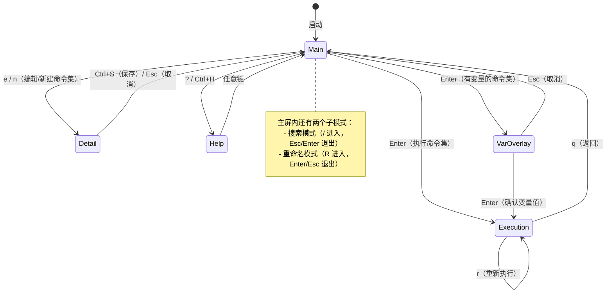
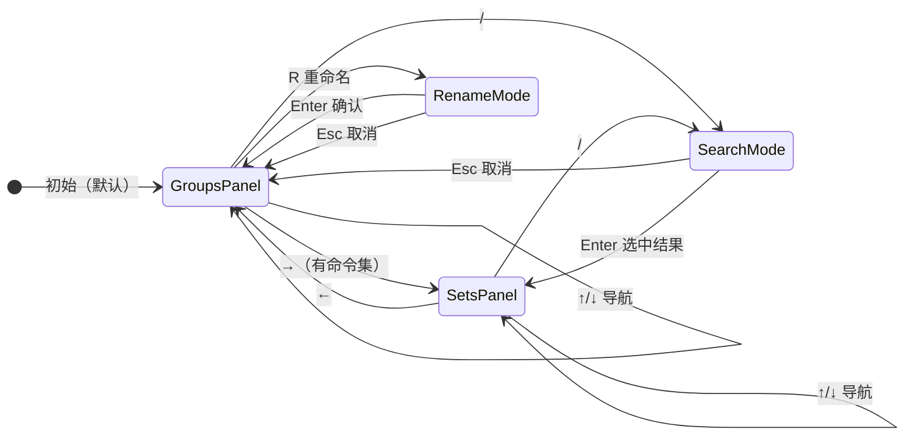
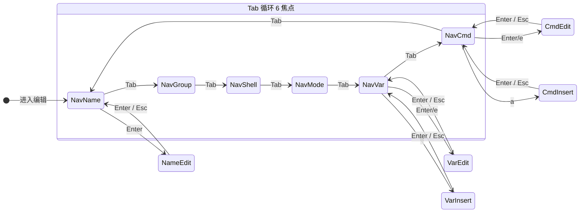
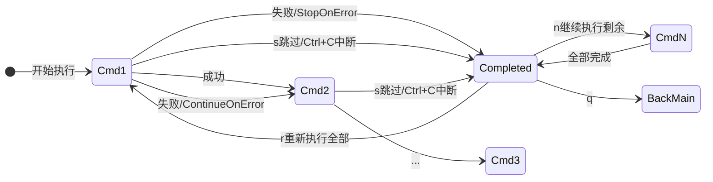
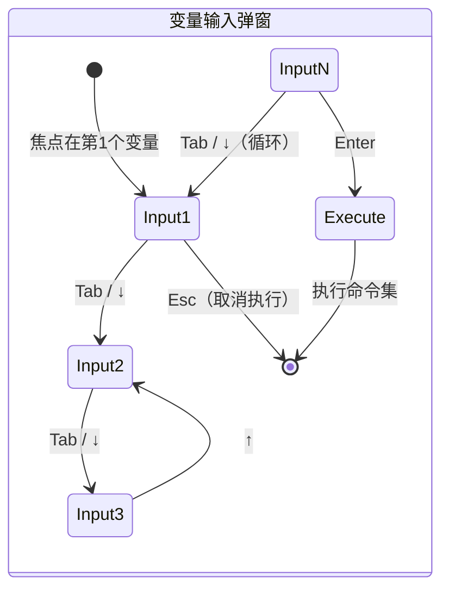

# Launcher 架构图

## 1. 整体界面跳转图



## 2. Main 屏内部逻辑


```

### Main 屏布局

```
┌──────────────────────────────────────────────────┐
│  Groups (左1/3)          │ Sets (右2/3)          │
│  ┌────────────────┐      │ ┌────────────────────┐│
│  │ ▶ Group1  (3)  │      │ │ 🛑 SetName [bash]  ││
│  │   Group2  (1)  │      │ │ ⏩ SetName  [zsh]  ││
│  │   Group3  (0)  │      │ │ ...                ││
│  │   (empty -     │      │ │                    ││
│  │    press g)    │      │ │                    ││
│  └────────────────┘      │ └────────────────────┘│
├──────────────────────────────────────────────────┤
│ [↑/↓] [←/→] Panel [Enter] Run [e] [n] [d] [/]   │
└──────────────────────────────────────────────────┘
```

## 3. Detail 屏内部逻辑



    Note -- 6个焦点区域用Tab/BackTab循环切换
    Note -- 导航模式下 ←/→ 切换 Group/Shell/ExecMode
    Note -- d 删除选中的 Variable/Command
    Note -- Ctrl+S 保存全屏, Esc 取消返回
```

### Detail 屏布局

```
┌─── Edit: CommandSetName ──────────────────────────┐
│  Name:  [deploy backend              ]     ← Enter编辑 │
│  Group: Deploy                             ← ←/→切换   │
│  Shell: bash                              ← ←/→切换   │
│  Mode:  Stop on Error                     ← ←/→切换   │
│                                                    │
│  ┌─ Variables (2) ─────────────────────────┐       │
│  │  server = 192.168.1.100                │       │
│  │  branch = main                         │       │
│  │  ▶ new_var = value             ← 插入预览│       │
│  └─────────────────────────────────────────┘       │
│                                                    │
│  ┌─ Commands (3) ─────────────────────────┐       │
│  │  #0  ssh {{server}} 'git pull'        │       │
│  │  #1  ssh {{server}} 'docker up'       │       │
│  │  #2▶ docker-compose restart  ← 编辑中/插入预览  │
│  └─────────────────────────────────────────┘       │
│                                                    │
│  [a] Add  [e] Edit  [d] Delete  [Tab] Next  Ctrl+S │
└────────────────────────────────────────────────────┘
```

### 变量编辑按键保护

```
变量格式： name=value
            ^-- 不可删除/←移动到此左边
               ^-- 光标自由在此区域
```

| 按键 | 效果 |
|------|------|
| ← | 不能移过 = 号 |
| Backspace | 不能删掉 = 号及以前部分 |
| Delete | 不能删掉 = 号 |
| Home | 光标到开头（绕过保护，可进入 name 区） |

## 4. Execution 屏内部逻辑



    state "命令状态" as States {
        ⏳ Pending → ▶ Running → ✅ Success
        ▶ Running → ❌ Failure
        ▶ Running → ⏭ Skipped (通过 s/Ctrl+C)
        ⏳ Pending → ⏭ Skipped (剩余命令)
    }
```

### Execution 屏布局

```
┌─── Executing: CommandSetName [Running...] ────────┐
│                                                    │
│  ✅ $ echo "Hello" (0.15s)                        │
│    Hello                                           │
│                                                    │
│  ▶ $ sleep 10                         ← 正在执行   │
│                                                    │
│  ⏳ $ docker-compose up -d            ← 等待中     │
│                                                    │
│  ⏳ $ curl -I {{server}}                           │
│                                                    │
│  3 / 4 completed, 2 succeeded, 1 failed            │
│                                                    │
│ [q] Back to main  [s] Skip current  [Ctrl+C]       │
└────────────────────────────────────────────────────┘
```

## 5. 变量输入覆盖层（VariableScreen）



### 变量弹窗布局

```
┌─── Set Variables ───────────┐
│  host = 192.168.1.100     ← 黄色=当前焦点 │
│  port = 8080                  │
│  branch = main              │
│                              │
│ [Enter]  [Esc]  [Tab/Down]  │
└──────────────────────────────┘
```

## 6. CLI 模式（独立路径）


### CLI 命令一览

```bash
launcher                      # 进入 TUI（无参数）
launcher run --id <uuid>      # 按 UUID 执行
launcher run --group G --set S --var key=val  # 按名称执行 + 变量覆写
launcher run --id XXX --var default           # 使用默认变量值（不提示）
launcher search --set <query>  # 搜索命令集
launcher search --group <query> # 搜索分组
```
